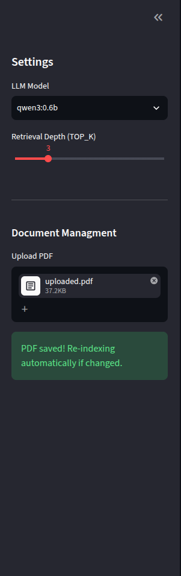

# Local PDF RAG

A local Retrieval-Augmented Generation (RAG) chatbot built with Python, Streamlit, FAISS, Sentence Transformers, and Ollama.

## Features

- Upload PDF documents
- Semantic search using FAISS
- Local LLM inference with Ollama
- Conversation memory
- Source page citations
- Streamlit web interface

## Tech Stack

- Python
- Streamlit
- FAISS
- Sentence Transformers
- Ollama
- PyPDF

# Screenshots

## Home Page


---

## PDF Upload



---

## Chat Interface


## Run

```bash
pip install -r requirements.txt
streamlit run app.py


